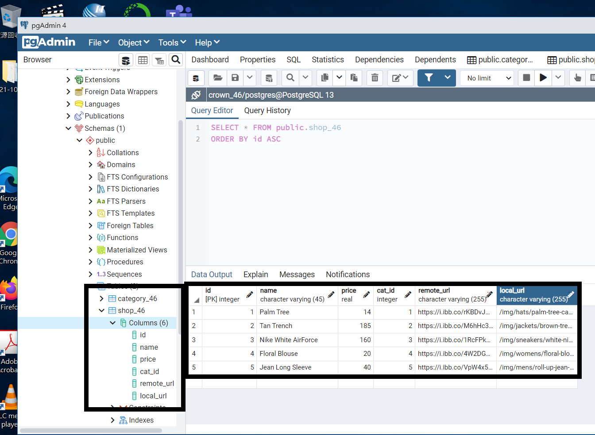
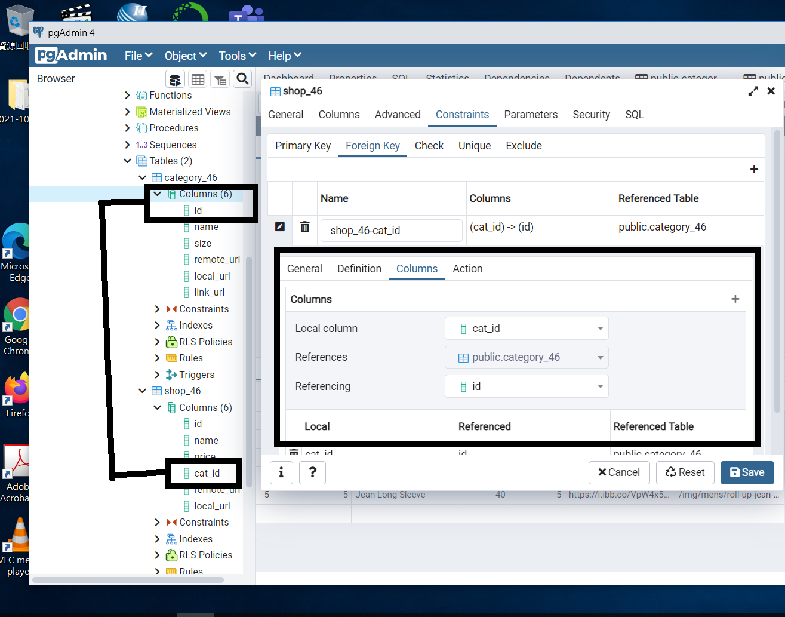
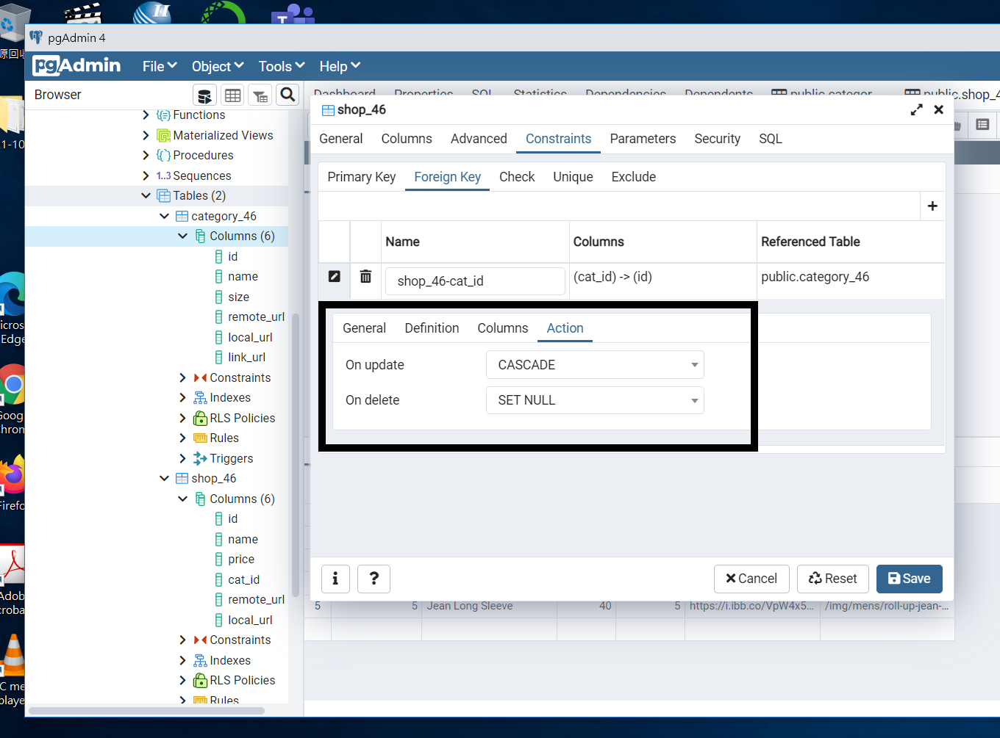

1. 產生一個 table, shop_xx，欄位 id, name, price, cat_id, remote_url, local_url，每一個 category 輸入一筆資料，截圖並畫重點如下：
   

---

2. 產生一個 foreign key, 將 shop_xx 當中的 cat_id 連結到 category_xx 的 id, Update 設定為 Cascading, Delete 設定為 set null。
   
   
